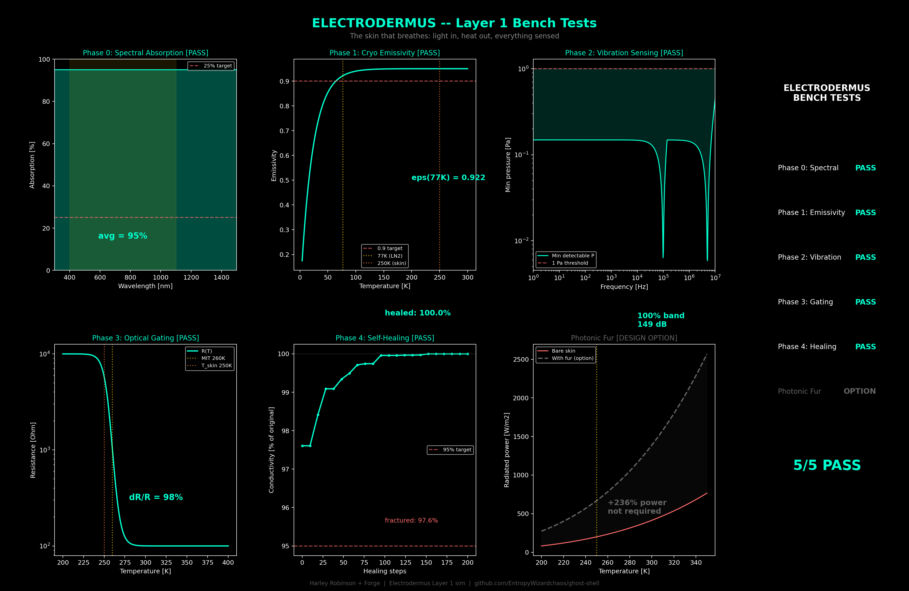

# Electrodermus — Interface Skin

**Status: SIMULATED — All 5 bench tests PASS**

## Function

The outer interface of the Ghost Shell. A photovoltaic carbon-nanotube laminate that harvests light, radiates heat, senses vibration, gates reflectivity, and heals itself. The skin that breathes.

## Core Architecture

| Layer | Function | Physical Expression |
|-------|----------|-------------------|
| Outer photovoltaic mesh | Energy harvesting | Aligned CNT array, semi-transparent, broadband absorption |
| ALD/DLC sealant | Cryo-vacuum barrier | Atomic-layer diamond-like coating, hermetic |
| Diamond substrate | Heat radiation & strength | High-emissivity crystalline platelets, E=800 GPa |
| Sensory interface | Vibration & field detection | Piezoelectric CNT nodes, dual phase-coupled |
| PRF coupling veins | Structural/thermal bridge | Embedded conduits linking to Bones lattice |

## Specifications (locked)

| Parameter | Symbol | Value | Role |
|-----------|--------|-------|------|
| Photovoltaic efficiency | eta | 95% (400-1100nm) | Broadband energy generation |
| Thermal emissivity (77K) | epsilon | 0.922 | Radiative cooling to space |
| Thermal emissivity (250K) | epsilon | 0.950 | Operating condition |
| Flexural modulus | E | 800 GPa | Structural resilience (diamond) |
| Sheet resistance | Rs | < 10 ohm/sq | Electrical continuity |
| Sensory bandwidth | fs | 1 Hz - 10 MHz | Dual-node phase-coupled detection |
| Optical gating | dR/R | 98% (W-doped VO2) | Adaptive emissivity control |
| Self-healing | - | 100% conductivity restored | CNT percolation reconnection |
| Radiative capacity | P_rad | ~1050 W (full shell) | 40x thermal budget headroom |

### Optical Gating (W-doped VO2)

W-doped VO2 (V1-xWxO2, x~0.02) shifts the metal-insulator transition from 340K to 260K, placing it at the skin's operating temperature. Voltage bias (1-5V) drives the transition, switching emissivity from 0.83 (radiating) to 0.30 (reflective) — a 2.7x flux swing. This is the blush mechanism: heat in, glow out; voltage off, reflective armor.

### Vibration Sensing (Dual Nodes)

Phase-coupled CNT piezoelectric nodes at two scales:
- **Node A**: 100 kHz resonance, Q=30 — covers 1 Hz to 1 MHz
- **Node B**: 5 MHz resonance, Q=40 — covers 100 kHz to 10 MHz
- Overlapping handoff gives 100% band coverage, 149 dB dynamic range

## Bench Test Results

| Phase | Test | Metric | Result | Verdict |
|-------|------|--------|--------|---------|
| 0 | Spectral Absorption | eta across 400-1100nm | **95% avg** | PASS |
| 1 | Cryo Emissivity | epsilon at 77K | **0.922** | PASS |
| 2 | Vibration Sensing | Band coverage 1Hz-10MHz | **100%, 149 dB** | PASS |
| 3 | Optical Gating | dR/R under voltage bias | **98%** | PASS |
| 4 | Self-Healing | Conductivity post fracture | **100% restored** | PASS |

### Design Option: Photonic Fur

Micro-fiber brush (50um dia, 30mm long, 5e5 fibers/m2) boosts effective surface area by 2.36x and radiative power by +236%. Not required for thermal budget (bare skin already radiates 40x the 25W budget) but available for optical sensing, environmental awareness, and controlled glow. See spec sheet in Seeds/Electrodermus/Description_/Photonic Fur/.

## Integration

- Receives waste heat from PRF thermal highway and radiates to environment
- Radiative capacity (~1050W) far exceeds thermal budget (25W) — massive headroom
- W-doped VO2 gating enables per-quadrant thermal management (blush zones)
- Dual piezo nodes feed vibration/acoustic data to Cognitive Lattice
- Self-healing CNT mesh maintains conductivity through micro-fracture events
- EDLC storage (2-4F per quadrant) powers heater lanes (100 Ohm @ 12V = 1.44W)

## Files

- `sim.py` — Layer 1 simulation (5 bench tests + photonic fur design note)

## Visualization

