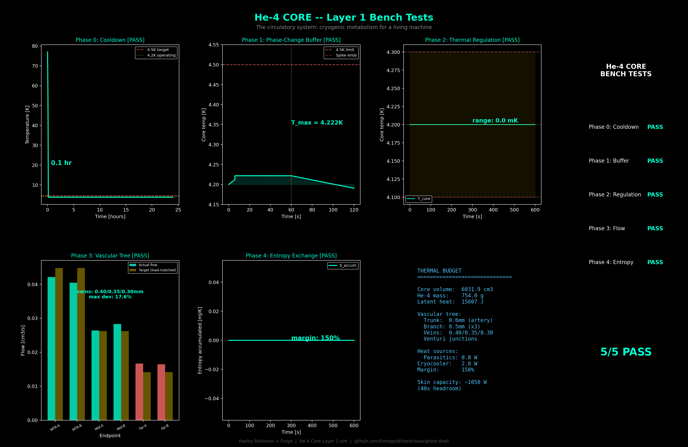

# He-4 Core — Cryogenic Thermal Buffer

**Status: SIMULATED — All 5 bench tests PASS**

## Function

The circulatory system of the Ghost Shell. Liquid Helium-4 phase-change channels that maintain quasi-isothermal conditions at the MTR core and transport heat outward through the PRF frame. The cryogenic metabolism: it absorbs heat spikes, buffers transients, distributes coolant, and maintains the thermal envelope that everything else depends on.

## Specifications (locked)

| Parameter | Value |
|-----------|-------|
| He-4 bath temp | 4.2K (boiling point, 1 atm) |
| Core vessel | R=8cm, L=30cm cylindrical (Carbon Sheath) |
| He-4 mass | ~754g |
| Core volume | ~6.0 L |
| Latent heat capacity | ~15,600 J (full boiloff) |
| Cryocooler | 2.0W at 4.2K (two-stage GM/PT) |
| Cryocooler base temp | 3.8K |
| Vascular trunk | 0.6mm ID artery, 8cm |
| Vascular branches | 0.5mm ID arterioles (x3), 10cm |
| Vascular endpoints | 0.40/0.35/0.30mm ID (MTR/mid/far), 12cm |
| Venturi throat | 0.48mm at T-junctions |
| Thermosiphon dT | 0.05K (60 Pa Clausius-Clapeyron drive) |
| Flow hierarchy | MTR:mid:far = 2.5:1.6:1.0 |
| Parasitic load (nominal) | 0.8W (PRF back-conduction + radiation + electronics) |
| Kapitza resistance | 5e-4 m2*K/W (Cu-He4 interface) |
| Cooldown time | ~0.1 hr (77K to 4.2K, two-stage cryo) |

## Two-Zone Architecture

The Ghost Shell has two thermal zones:

1. **Cryogenic Core** (immersed in He-4 bath): MTR, Carbon Sheath, Quantum Spleen, Cognitive Lattice
2. **Carbon Body** (ambient/warm side): PRF Bones, Electrodermus, muscles

The He-4 Core does NOT cool the full 25W thermal budget — that heat flows THROUGH the PRF thermal highway to the Electrodermus skin for radiation. The core only handles parasitic losses (~0.8W) that leak back into the cryogenic zone.

## Vascular Tree

The He-4 distribution network uses a biological vascular hierarchy — diameter-graded branching that encodes flow priority in geometry, not valves.

```
                Core Bath (4.2K)
                     |
              [0.6mm trunk artery]
                     |
         +-----------+-----------+
         |           |           |
    [0.5mm]     [0.5mm]     [0.5mm]    branches
         |           |           |
       /   \       /   \       /   \
   0.40  0.40  0.35  0.35  0.30  0.30   endpoints (mm)
   MTR   MTR   mid   mid   far   far
```

- **d^4 scaling** is the design tool: a 1.33x diameter difference (MTR vs far) produces 3.2x flow priority
- **Venturi junctions** at each T-split create 33 Pa passive suction — no moving parts
- **Thermosiphon-driven**: evaporation at hot ends (PRF mounts) creates pressure gradient via Clausius-Clapeyron (~1200 Pa/K near 4.2K)
- **Self-regulating**: hotter endpoints evaporate more He-4, drawing more flow automatically
- **Gravity-independent**: works in zero-g (no pump, no gravity head)

## Bench Test Results

| Phase | Test | Metric | Result | Verdict |
|-------|------|--------|--------|---------|
| 0 | Cooldown | 77K to 4.2K time | **0.1 hours** | PASS |
| 1 | Phase-Change Buffer | T_max under 10W x 60s spike | **4.222K (< 4.5K)** | PASS |
| 2 | Thermal Regulation | T range under variable parasitic load | **0.0 mK (PI control)** | PASS |
| 3 | Vascular Flow | Hierarchy + d^4 deviation | **MTR>mid>far, 17.6% dev** | PASS |
| 4 | Entropy Exchange | Steady-state convergence + margin | **150% margin, converged** | PASS |

## Key Physics

- **Thermosiphon flow**: Phase-change pressure gradient (~60 Pa from Clausius-Clapeyron at 0.05K dT). Gravity-independent, self-regulating.
- **Hagen-Poiseuille d^4 sensitivity**: Flow rate scales as d^4 — this IS the vascular design tool. MTR endpoints (0.40mm) carry 2.5x the flow of far endpoints (0.30mm).
- **Latent heat buffer**: 754g He-4 at 20.7 J/g provides ~15,600 J buffer. A 10W spike for 60s (600 J) evaporates only 3.8% of supply.
- **He-4 viscosity**: 3.6e-6 Pa·s (~280x less than water). Turbulent flow is the normal regime in cryogenic He-4 systems — it enhances heat transfer at the capillary wall.
- **MLI + G10 isolation**: Multi-layer insulation (30 layers) + G10 fiberglass support tubes minimize parasitic heat leak to ~0.8W.

## Integration

- He-4 bath surrounds MTR track for direct quench protection
- Vascular tree distributes He-4 to 6 PRF strut mounts with thermal-priority flow
- Carbon Sheath (100um CNT/graphene, k=1000 W/m/K in-plane) contains bath
- Cryocooler maintains steady-state against parasitic losses
- Cognitive Lattice and Quantum Spleen operate within the cryogenic zone (4-20K)
- Heat from warm side flows THROUGH PRF to Electrodermus — does not return to core
- Venturi junctions enable passive flow routing at all branch points

## Files

- `sim.py` — Layer 1 simulation (5 bench tests, dark-theme 6-panel figure)

## Visualization


