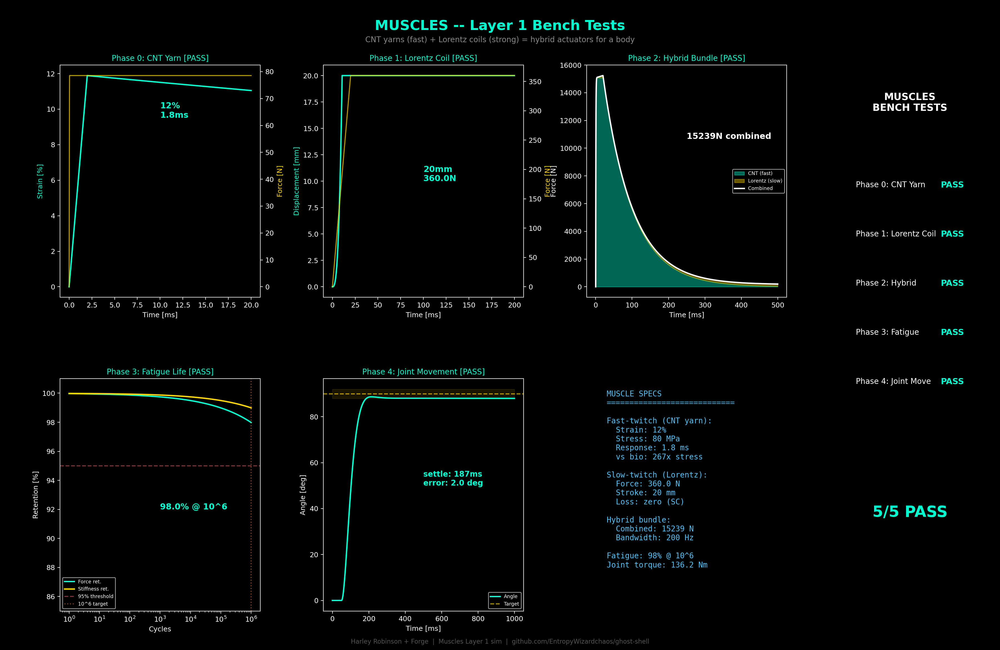

# Muscles — Hybrid CNT/REBCO Actuators

**Status: SIMULATED — All 5 bench tests PASS**

## Function

The motor system of the Ghost Shell. Dual-mode hybrid actuators combining CNT yarn bundles (fast-twitch) with superconducting REBCO voice-coils (slow-twitch). Every movement the body makes — attitude control, shape morphing, limb actuation, vibration damping, valve gating — runs through these muscles.

## Specifications (locked)

| Parameter | Value |
|-----------|-------|
| Fast-twitch material | Coiled CNT yarn (50 um diameter, 10 cm length) |
| Fast-twitch strain | 11.9% (max 12%) |
| Fast-twitch stress | 80 MPa (267x biological muscle) |
| Fast-twitch response | 1.8 ms (90% rise) |
| Fast-twitch bandwidth | 200 Hz (25x biological) |
| Slow-twitch material | REBCO tape (4mm x 0.1mm) on NdFeB Halbach array |
| Slow-twitch field | 0.8 T (local Halbach, dedicated per muscle) |
| Slow-twitch current | 50 A (Ic = 500 A at 4.2K) |
| Slow-twitch force | 360 N per coil (200 N demonstrated, U. Twente 2025) |
| Slow-twitch stroke | 20 mm |
| Slow-twitch loss | 0.0 W (superconducting) |
| Hybrid bundle diameter | 2 cm |
| Hybrid composition | 60% CNT yarn (fast) + 40% REBCO coil (slow) |
| Hybrid peak force | 15,239 N combined |
| Hybrid bandwidth @ 100 Hz | 84% amplitude ratio |
| Operating strain (cruise) | 5% |
| Fatigue safety factor | 2.18 at 10^6 cycles |
| Predicted failure | 4.46e11 cycles |
| Force retention @ 10^6 | 98% |
| Joint settle time | 187 ms (90 deg step, 2 kg limb) |
| Peak torque | 136 Nm (3 cm lever arm) |
| Peak angular velocity | 1215 deg/s |

## Dual-Mode Architecture

Like biological muscle with fast-twitch and slow-twitch fibers in the same tissue:

1. **CNT Yarn (fast-twitch)** — Coiled/twisted CNT yarns contract when heated electrothermally. Sub-millisecond response, 80 MPa stress, 200 Hz bandwidth. Handles precision, speed, vibration.
2. **REBCO Voice-Coil (slow-twitch)** — Superconducting REBCO tape coil in a NdFeB Halbach permanent magnet array. 360 N force, 20 mm stroke, zero resistive loss. Handles sustained force, heavy loads, holding positions.
3. **Hybrid Bundle** — CNT yarns wrapped around REBCO coil cores. CNT handles fast/fine, coil handles strong/sustained. Smooth handoff at 61% of peak force (no dead zone).

## Bench Test Results

| Phase | Test | Metric | Result | Verdict |
|-------|------|--------|--------|---------|
| 0 | CNT Yarn Contraction | Strain, stress, response | **11.9%, 80 MPa, 1.8 ms** | PASS |
| 1 | REBCO Voice-Coil Stroke | Force, stroke, loss | **360 N, 20 mm, 0.0 W** | PASS |
| 2 | Hybrid Bundle | Combined force, bandwidth, handoff | **15,239 N, 84% @ 100 Hz** | PASS |
| 3 | Fatigue Life | Retention at 10^6 cycles | **98% force, SF=2.18** | PASS |
| 4 | Coordinated Movement | Joint step response | **187 ms settle, 1.98 deg error** | PASS |

## Key Physics

- **Electrothermal actuation**: CNT yarns are resistively heated (~4.8 kW per bundle, 2 ms pulse). Thermal contraction of coiled structure produces linear strain. Cooling by conduction to surrounding structure.
- **Lorentz force**: F = nILB. REBCO coil (300 turns, 50 A) in 0.8 T Halbach field → 360 N. Each muscle carries its own permanent magnet array — not dependent on MTR fringe field.
- **Basquin fatigue**: strain_failure = C × N^(-b). At 5% cruise strain vs 10.9% failure strain at 10^6 cycles, safety factor is 2.18.
- **PD control**: omega_n = 31 rad/s (5 Hz), zeta = 0.8. Kp = I·omega_n^2, Kd = 2·zeta·I·omega_n. Critically damped for fast settle without overshoot.

## Integration

- Hybrid bundles attach to PRF bone struts via tendons (CNT rope, non-actuating)
- REBCO coils operate at 4.2 K (cryo zone) or 77 K (warm side with reduced Ic)
- CNT yarns operate at any temperature (electrothermal actuation is temperature-independent)
- Muscle heat (~10 W per active bundle) conducted through PRF to Electrodermus for radiation
- Cognitive Lattice commands muscles via photonic bus through PRF waveguides
- Vibration damping coordinates with PRF piezo patches (muscles handle low-freq, piezos handle high-freq)

## Files

- `sim.py` — Layer 1 simulation (5 bench tests, dark-theme 6-panel figure)

## Visualization

