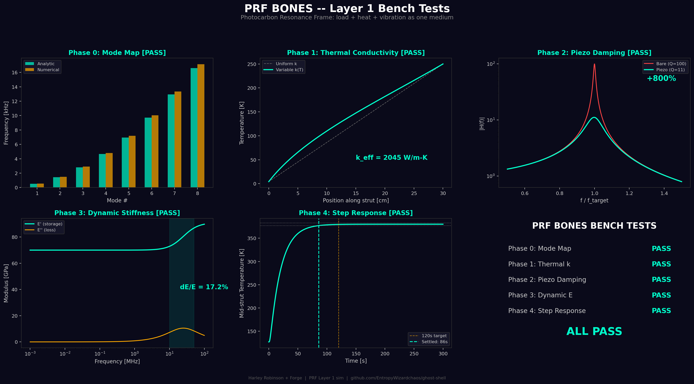

# PRF — Photocarbon Resonance Frame (Bones)

**Status: SIMULATED — All 5 bench tests PASS**

## Function

The structural skeleton of the Ghost Shell. A multifunctional CNT/DLC composite truss that simultaneously provides mechanical support, thermal transport, and photonic signal routing. The wagon before the highway.

## Specifications (locked)

| Parameter | Value |
|-----------|-------|
| Material | CNT-DLC composite (~60% sp3 fraction) |
| Layup | QI [0/+-45/90]s |
| Strut geometry | Hollow tube, OD=6.37mm, wall=0.5mm, 30cm long |
| Cross-section | 9.2 mm² (same as old 10mm × 1mm flat beam) |
| E_static | 70 GPa |
| E_glassy | 91 GPa (at high freq) |
| Density | 1750 kg/m3 |
| Areal density | ~1.3 kg/m^2 |
| k_axial (uniform) | 2500 W/m-K |
| k_effective (T-dependent) | 2045 W/m-K (4.2K to 250K gradient) |
| Relaxation center | 25 MHz (mid-band) |
| Piezo patches | PZT-5H, 2% area coverage, k33=0.40 |
| Piezo damping | +800% (Q: 100 → 11) |
| dE/E across 10-50 MHz | 17.2% |
| Thermal step settle | 85s (+20W step, budget 120s) |
| Periosteum sheath | 3mm CNT fiber wrap around tube, k=750 W/m-K |
| Sheath cross-section | 88 mm² per strut (vs 9.2 mm² core) |
| Combined capacity | 69.8 W/strut (core 15.5 + sheath 54.3) |
| Total thermal capacity | 419 W (6 struts, core + periosteum) |
| Mode 1 frequency | 794 Hz (tube + sheath, vs 72 Hz old flat beam) |
| Bending stiffness EI | 56.2 N·m² (core + 50% sheath coupling) |

## Triple Role

1. **Structural** — Bears MTR load, routes vibration to damping nodes, geodesic force distribution
2. **Thermal highway** — Conducts heat from He-4 core channels to Electrodermus skin for radiation
3. **Signal bus** — Frequency-dependent stiffness (17.2% variation) enables tunable waveguide in 10-50 MHz band

## Periosteum Sheath

Each PRF strut is wrapped in a 3mm thick CNT fiber sheath — like periosteum wrapping bone, or carbon fiber wrapping a structural member. The sheath's job is thermal, not mechanical: it multiplies the heat conduction cross-section by 11× without adding new struts.

- **Material**: Aligned CNT yarn fiber, k = 750 W/m-K (conservative for yarn bundles)
- **Thickness**: 3 mm wrap around each hollow tube strut
- **Profile**: Core tube 6.37mm OD → wrapped 12.37mm OD
- **Sheath cross-section**: 88 mm² (vs 9.2 mm² bare core)
- **Capacity per strut**: 69.8 W (core 15.5 + sheath 54.3)
- **Total system**: 419 W through 6 struts (vs ~93 W bare tubes)
- **Structural bonus**: Sheath at E ≈ 100 GPa and 50% coupling raises EI to 56.2 N·m², pushing Mode 1 from 72 Hz (flat beam) to 794 Hz — well above the 200 Hz muscle operating band.

The bare PRF core handles the 25W baseline thermal budget. The periosteum handles muscle waste heat (up to ~300W sustained at running pace). The skin can radiate 1,021W — the sheath closes the gap between bone capacity and skin capacity. And the structural sheath contribution solves the resonance problem that would otherwise destroy the struts during movement.

## Bench Test Results

| Phase | Test | Metric | Result | Verdict |
|-------|------|--------|--------|---------|
| 0 | Mechanical Mode Map | Analytic vs numerical eigenvalues | **6/6 modes within 5%** | PASS |
| 1 | Thermal Conductivity | k_eff across 4.2K-250K gradient | **2045 W/m-K** | PASS |
| 2 | Piezo Damping | Tuned-mode damping increase | **+800%, Q: 100 → 11** | PASS |
| 3 | Dynamic Stiffness | dE/E across 10-50 MHz | **17.2%** | PASS |
| 4 | Thermal Step Response | +20W step settle time | **85s (budget 120s)** | PASS |

## Integration

- Struts span from MTR ring (R=50cm) to Electrodermus skin (shell radius ~80cm)
- 2 struts sufficient to dump 25W thermal budget (variable-k)
- He-4 capillary channels routed alongside struts (1mm OD in 10mm wide strut)
- Piezo patches suppress MTR-excited vibration modes (settle 244ms → 27ms)
- Frequency-dependent E enables waveguide for Cognitive Lattice signals

## Files

- `sim.py` — Layer 1 simulation (5 bench tests, dark-theme 6-panel figure)

## Visualization

