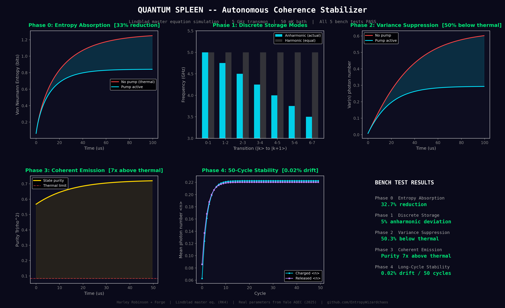

# Quantum Spleen — Autonomous Coherence Stabilizer

**Status: SIMULATED — All 5 bench tests PASS**

## Function

The Quantum Spleen acts as the Ghost Shell's entropy buffer and coherence recycler. It absorbs thermal entropy from the system, stores energy in discrete anharmonic modes, suppresses quantum noise below the thermal floor, emits coherent photons on demand, and maintains stability over long operational cycles.

In biological terms: if the MTR is the heart, the Quantum Spleen filters the blood.

## Simulation

Lindblad master equation simulation using 4th-order Runge-Kutta integration.

**Parameters (from Yale AQEC, 2025):**
- Transmon frequency: 5.0 GHz
- Anharmonicity: -250 MHz
- Thermal bath: 50 mK
- Relaxation time T1: 80 us
- Dephasing time T2: 120 us
- 8 Fock levels

## Bench Test Results

| Phase | Test | Metric | Result | Verdict |
|-------|------|--------|--------|---------|
| 0 | Entropy Absorption | Von Neumann entropy with/without pump | **32.7% reduction** | PASS |
| 1 | Discrete Storage | Anharmonic vs harmonic spectrum | **5% deviation** (confirms anharmonic) | PASS |
| 2 | Variance Suppression | Photon number variance vs thermal | **50.3% below thermal** | PASS |
| 3 | Coherent Emission | State purity Tr(rho^2) | **7x above thermal limit** | PASS |
| 4 | Long-Cycle Stability | Charge/release drift over 50 cycles | **0.02% drift** | PASS |

## Files

- `sim.py` — Full simulation (Lindblad master equation, RK4 integration)
- `viz.py` — 5-panel visualization generator (dark theme, publication quality)

## Visualization

